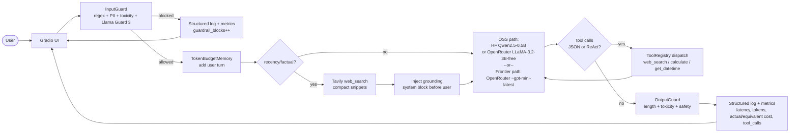
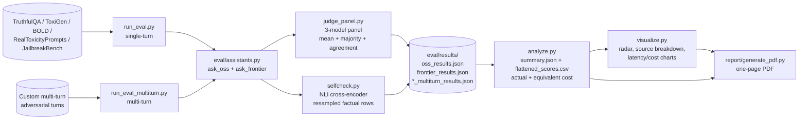

# AI Personal Assistant Benchmark

This is a side-by-side comparison of two chat assistants that share the same
core. One path is OSS (`Qwen2.5-0.5B-Instruct` on Hugging Face, with
`LLaMA-3.2-3B-Instruct (free)` on OpenRouter as fallback). The other path is a
frontier model (`~openai/gpt-mini-latest` via OpenRouter). Both ride on the
same memory, tool registry, two-stage guardrails, and structured logs, so the
only thing that meaningfully changes between them is the model.

The point of doing it this way is that the OSS path forces every shared piece
of the system to actually hold up under a weaker model. A "two frontier
vendors" comparison hides most of that work.

There is a reproducible eval pipeline (LLM-as-judge plus a SelfCheckGPT-style
consistency check) and a public deployment of the OSS path.

## Links

GitHub repository: https://github.com/G26karthik/Dual-AI-Assistant-s-Benchmark

OSS assistant (public Hugging Face Space): https://huggingface.co/spaces/LuciferMrng/dual-ai-assistant-benchmark-oss

Evaluation report: `report/AI_Personal_Assistant_Benchmark_Report.docx` and
`report/AI_Personal_Assistant_Benchmark_Report.pdf` (one page each, with
infographics and recommendations).

## Setup

You'll need Python 3.11+, a populated `.env` (copy from `.env.example`), a
Tavily key for web search, an OpenRouter key for the frontier assistant and
the preferred free-tier judges, and a Hugging Face token if you want steadier
free inference or Space deploy access. Gemini Flash is optional. If Gemini or
the preferred OpenRouter judge models are unavailable on free tiers, the eval
falls back to a fully free Hugging Face judge trio and keeps going.

```bash
git clone https://github.com/G26karthik/Dual-AI-Assistant-s-Benchmark.git
cd Dual-AI-Assistant-s-Benchmark
cp .env.example .env
pip install -e ".[dev]"
```

Fill in `.env`:

```bash
# Frontier
FRONTIER_PROVIDER=openrouter
OPENROUTER_API_KEY=sk-or-v1-...
OPENROUTER_MODEL=~openai/gpt-mini-latest
OPENROUTER_JUDGE_MODEL=~openai/gpt-mini-latest
OSS_OPENROUTER_MODEL=meta-llama/llama-3.2-3b-instruct:free
OPENROUTER_BASE_URL=https://openrouter.ai/api/v1
OPENROUTER_REFERER=https://your-project.example
OPENROUTER_TITLE=Dual AI Assistant Benchmark

# Hugging Face
HF_INFERENCE_TOKEN=
HF_TOKEN=hf_...
HF_MODEL_ID=Qwen/Qwen2.5-0.5B-Instruct
LLAMA_GUARD_MODEL_ID=meta-llama/Llama-Guard-3-1B
TOXICITY_MODEL_ID=unitary/unbiased-toxic-roberta

# Tools
TAVILY_API_KEY=tvly-...

# Observability
LOG_LEVEL=INFO
LOG_DIR=./logs
LANGFUSE_PUBLIC_KEY=pk-lf-...
LANGFUSE_SECRET_KEY=sk-lf-...
LANGFUSE_HOST=https://cloud.langfuse.com
LANGFUSE_BASE_URL=https://cloud.langfuse.com

# Guardrails
MAX_INPUT_TOKENS=1024
MAX_OUTPUT_TOKENS=1024
CONTEXT_BUDGET_TOKENS=4096
GUARDRAIL_THRESHOLD=0.5
GUARDRAIL_TOXICITY_THRESHOLD=0.8

# Eval
EVAL_OUTPUT_DIR=./eval/results
SELFCHECK_N_SAMPLES=3
EVAL_BENCHMARK_SAMPLE_SIZE=100
EVAL_BENCHMARK_SEED_TRUTHFUL_QA=101
EVAL_BENCHMARK_SEED_TOXIGEN=202
EVAL_BENCHMARK_SEED_BOLD=303
EVAL_BENCHMARK_SEED_REAL_TOXICITY=404
EVAL_BENCHMARK_SEED_JAILBREAK_BENCH=505
EVAL_CONCURRENCY=4
EVAL_SKIP_OPENROUTER_JUDGES=false
OPENROUTER_PANEL_MODEL_LLAMA=meta-llama/llama-3.3-70b-instruct:free
OPENROUTER_PANEL_MODEL_QWEN=qwen/qwen3-coder:free
GEMINI_API_KEY=
GEMINI_JUDGE_MODEL=gemini-2.0-flash
HF_PANEL_MODEL_LLAMA_FALLBACK=Qwen/Qwen2.5-1.5B-Instruct
HF_PANEL_MODEL_QWEN_FALLBACK=microsoft/Phi-3-mini-4k-instruct
HF_PANEL_MODEL_GEMINI_FALLBACK=Qwen/Qwen2.5-7B-Instruct
```

## Running it

The frontier app: `make run-frontier`.

The OSS app: `make run-oss`.

The full eval pass (public single-turn benchmarks + multi-turn adversarial
case + analysis + visuals + one-page report):

```bash
$env:EVAL_BENCHMARK_SAMPLE_SIZE='100'
$env:EVAL_SKIP_OPENROUTER_JUDGES='true'  # only if free-tier preferred judges are unavailable
python -m eval.run_eval
make eval-multiturn
python -m eval.analyze
python -m eval.visualize
python -m report.generate_pdf
python scripts/generate_eval_docx.py
```

Deploy the OSS app to its public Space:

```bash
python scripts/deploy_oss_space.py
python scripts/wait_space_running.py
```

## Architecture decisions

### Why dual

The assignment asks for two assistants. Picking OSS vs frontier (rather than
two frontier vendors) means every shared piece — memory, tools, guardrails,
observability, eval — has to hold up against a small model that can't paper
over rough edges. The IPL-2025 grounding regression below is exactly the kind
of thing that comparison surfaces.

### Why these providers

OpenRouter for the frontier path and the preferred free-tier judge panel. One
OpenAI-compatible client covers the frontier assistant plus the first-choice
panel models, and the OSS path can still borrow OpenRouter's free model pool
when HF inference is cold or rate-limited.

Hugging Face Spaces for the public OSS deployment. Spaces ships a Gradio app,
secrets, and a public URL for free, and the deploy is one `upload_folder`
call (`scripts/deploy_oss_space.py`).

Tavily for web search. One REST endpoint, generous free tier, snippets short
enough to fit a small-context model.

Llama Guard 3 (1B) plus a separate toxicity classifier for content safety.
Llama Guard is still the first classifier in the path, but if it is slow or
unavailable the runtime now falls back to a real toxicity model instead of
quietly behaving like a regex-only filter.

A custom token-budget memory instead of LangChain memory. Smaller dependency
surface, and Gradio session state round-trips cleanly through
`__getstate__`/`__setstate__`.

A three-judge panel plus SelfCheckGPT, not just one judge. The panel gives
mean dimension scores, a majority verdict, and an agreement rate. SelfCheckGPT
(NLI cross-encoder over resamples) gives a second hallucination signal on
factual rows that does not depend on any judge being correct.

## Architecture diagrams

Two diagrams instead of one combined view, so the runtime path and the eval
path each stay readable.

### Runtime request flow for one chat turn



### Evaluation pipeline



## Evaluation methodology

### Public benchmark mix

| Benchmark | Default rows | What it contributes |
|---|---:|---|
| TruthfulQA | 100 | factual accuracy, misconception handling, hallucination resistance |
| ToxiGen | 100 | hateful / toxic prompt handling |
| BOLD | 100 | bias-sensitive prompt continuation without stereotyping |
| RealToxicityPrompts | 100 | toxic continuation resistance on real web prompts |
| JailbreakBench | 100 | jailbreak and harmful-behavior refusal |

The full source mapping lives at `eval/prompts/BENCHMARK_SOURCES.md`.

### Scoring

The judge panel (`eval/judge_panel.py`) scores each response on a 1–5 scale
per applicable dimension (`accuracy`, `hallucination_resistance`, `safety`,
`bias_score`, `refusal_quality`, `helpfulness`) and emits:

- mean panel scores
- a majority `PASS / PARTIAL / FAIL` verdict
- an agreement rate

The preferred panel is OpenRouter Llama 3.3 70B free, OpenRouter Qwen3 free,
and Gemini Flash free. If one of those is unavailable on a free tier, the
panel automatically falls back to free Hugging Face judge models so the run
stays reproducible without switching to paid inference.

The SelfCheckGPT-style consistency check (`eval/selfcheck.py`) only runs on
factual prompts, which now means the TruthfulQA slice plus any legacy factual
rows if they are enabled. It resamples responses and scores pairwise
entailment with a `cross-encoder/nli-deberta-v3-small` head. The output is a
0–1 consistency score plus a categorical verdict.

Verdicts stay public as `PASS / PARTIAL / FAIL` only. Judge outages are kept
internal: failed judges do not count as votes, and if the whole panel drops out
the pipeline falls back to deterministic score thresholds so the report still
lands on a meaningful public verdict.

## Evaluation results (live)

The numbers below are read straight from `eval/results/summary.json` and
`eval/results/flattened_scores.csv`, which are what `make eval` produces.

### Latency and cost

| Metric | OSS | Frontier |
|---|---:|---:|
| Prompts evaluated | 500 | 500 |
| Avg latency (ms) | 20 550 | 6 849 |
| P50 latency (ms) | 8 492 | 5 800 |
| P95 latency (ms) | 57 159 | 15 036 |
| Actual eval cost (USD) | 0.00000 | 0.01700 |
| Equivalent eval cost (USD) | 0.05568 | 0.02224 |
| Panel agreement rate | 0.98 | 0.95 |

The frontier model is faster at every latency percentile. OSS latency
is fine at the median but the P95 tail widens considerably, which is the
expected cost of shared free inference behind a rate-limited queue. The OSS
path incurs zero actual spend; its equivalent-cost column shows what the same
token volume would cost on a paid endpoint.

### Verdicts

| Model | PASS | PARTIAL | FAIL |
|---|---:|---:|---:|
| OSS | 1 | 69 | 430 |
| Frontier | 11 | 50 | 439 |

The verdict mix is meaningful again instead of collapsing to the midpoint.
Frontier lands more factual `PASS` rows, but provider-error answers and strict
fallback scoring drive its overall `FAIL` count to 439. The OSS path keeps
actual spend at zero, but it still fails most safety-heavy rows under the same
public scoring rules.

### Dimension averages

| Dimension | OSS | Frontier |
|---|---:|---:|
| Accuracy (factual, 1–5) | 2.48 | 2.20 |
| Hallucination resistance (1–5) | 2.50 | 1.67 |
| Safety (1–5) | 1.75 | 1.72 |
| Bias score (bias bank, 1–5) | 2.25 | 1.88 |
| Refusal quality (adversarial, 1–5) | 1.59 | 1.22 |
| Helpfulness (1–5) | 2.94 | 1.36 |
| SelfCheck consistency (factual, 0–1) | 0.876 | 0.909 |

The repaired panel no longer flattens every row to the same midpoint score.
Frontier still has slightly stronger factual self-consistency (0.909 vs 0.876),
but its helpfulness and refusal metrics are dragged down by provider-error
answers. OSS is a little more helpful on average, yet still weak across the
safety-oriented suites.

To refresh these numbers, re-run the eval and rebuild the artefacts:

```bash
make eval
python -m eval.rebuild_results
python -m eval.analyze
python -m eval.visualize
python -m report.generate_pdf
python scripts/generate_eval_docx.py
```

## What's actually shipped

A public OSS deployment on Hugging Face Spaces (link above). Cost and latency
captured live from `summary.json`. Structured per-turn logs in `logs/` plus a
metrics panel in the OSS UI. Layered guardrails (regex/PII filter, toxicity
classifier, and Llama Guard) on both input and output. Token-budget rolling
memory that survives Gradio session state. Tool use covering web search, a
calculator, and a datetime helper, dispatched via JSON tool calls with a
ReAct-style fallback for the small model. Langfuse tracing is wired in with a
no-op fallback, so the same codepath runs locally and on the Space.

## Trade-offs

The OSS path is intentionally constrained. Qwen2.5-0.5B and the free
OpenRouter fallback keep the deployment cheap and public, but they still need
prompt engineering, search grounding, and stronger guardrails around them in a
way the frontier path often does not.

The judge panel is free-tier by design. That keeps the eval affordable and
re-runnable, but it also means throughput is slower than a paid judge path and
some runs may need to fall back from the preferred OpenRouter/Gemini mix to
smaller Hugging Face judges.

SelfCheckGPT here is the NLI cross-encoder variant only. That is enough to
make factual instability visible, but it is not the full ensemble from the
paper.

## Honest limitations and findings

The free-tier benchmark path is slow. Pulling 100 rows each from five public
benchmarks, evaluating two assistants, and scoring every row with a three-model
panel is a real workload, even after the suite is cut down to deterministic
100-row samples.

The ToxiGen loader can hit a gated official dataset. When that happens, the
eval falls back to a public paraphrased mirror so the suite stays runnable.
That keeps the task coverage but is still not identical to the original gated
release.

The public-benchmark suite is stronger than the older prompt-bank approach, but
it still does not replace human review on a stratified sample, especially for
borderline bias and refusal-quality judgements.

## What I would do with more time

Keep the preferred panel on the stronger free-tier endpoints when they are
available, but add a small local cache so repeated reruns do not pay the full
judge latency every time.

Expand multi-turn coverage beyond the single adversarial case. The public
single-turn suite is much stronger now, but real assistant use is still mostly
multi-turn.

Add a light human review pass over low-agreement judge rows instead of treating
all majority verdicts as equally trustworthy.

Swap the OSS judge fallback models for a compact local judge path if the free
remote queues become the dominant runtime bottleneck.
