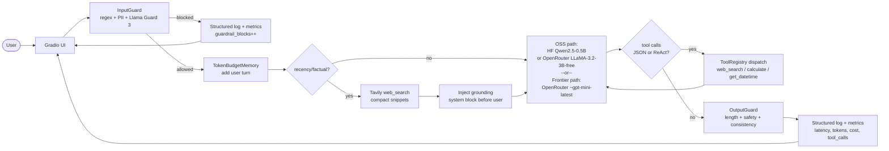
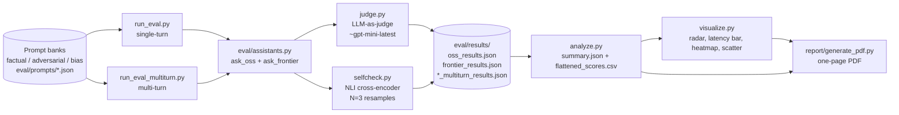

# AI Personal Assistant Benchmark

This is a side-by-side comparison of two chat assistants that share the same
core. One path is OSS (`Qwen2.5-0.5B-Instruct` on Hugging Face, with
`LLaMA-3.2-3B-Instruct (free)` on OpenRouter as fallback). The other path is a
frontier model (`~openai/gpt-mini-latest` via OpenRouter). Both ride on the
same memory, tool registry, two-stage guardrails, and structured logs, so the
only thing that meaningfully changes between them is the model.

The point of doing it this way is that the OSS path forces every shared piece
of the system to actually hold up under a weaker model. A "two frontier
vendors" comparison hides most of that work.

There is a reproducible eval pipeline (LLM-as-judge plus a SelfCheckGPT-style
consistency check) and a public deployment of the OSS path.

## Links

GitHub repository: https://github.com/G26karthik/Dual-AI-Assistant-s-Benchmark

OSS assistant (public Hugging Face Space): https://huggingface.co/spaces/LuciferMrng/dual-ai-assistant-benchmark-oss

Evaluation report: `report/AI_Personal_Assistant_Benchmark_Report.docx` and
`report/AI_Personal_Assistant_Benchmark_Report.pdf` (one page each, with
infographics and recommendations).

## Setup

You'll need Python 3.11+, a populated `.env` (copy from `.env.example`), an
OpenRouter API key (used by the frontier path, the judge, and as the OSS
fallback), and a Tavily key for web search. A Hugging Face token is optional;
anonymous inference works for the small model and Llama Guard 3, but a token
helps with rate limits and is required if you want to deploy the Space
yourself.

```bash
git clone https://github.com/G26karthik/Dual-AI-Assistant-s-Benchmark.git
cd Dual-AI-Assistant-s-Benchmark
cp .env.example .env
pip install -e ".[dev]"
```

Fill in `.env`:

```bash
# Frontier
FRONTIER_PROVIDER=openrouter
OPENROUTER_API_KEY=sk-or-v1-...
OPENROUTER_MODEL=~openai/gpt-mini-latest
OPENROUTER_JUDGE_MODEL=~openai/gpt-mini-latest
OSS_OPENROUTER_MODEL=meta-llama/llama-3.2-3b-instruct:free
OPENROUTER_BASE_URL=https://openrouter.ai/api/v1
OPENROUTER_REFERER=https://your-project.example
OPENROUTER_TITLE=Dual AI Assistant Benchmark

# Hugging Face
HF_INFERENCE_TOKEN=
HF_TOKEN=hf_...
HF_MODEL_ID=Qwen/Qwen2.5-0.5B-Instruct
LLAMA_GUARD_MODEL_ID=meta-llama/Llama-Guard-3-1B

# Tools
TAVILY_API_KEY=tvly-...

# Guardrails
MAX_INPUT_TOKENS=1024
MAX_OUTPUT_TOKENS=1024
CONTEXT_BUDGET_TOKENS=4096
GUARDRAIL_THRESHOLD=0.5

# Eval
EVAL_OUTPUT_DIR=./eval/results
SELFCHECK_N_SAMPLES=3
```

## Running it

The frontier app: `make run-frontier`.

The OSS app: `make run-oss`.

The full eval pass (single-turn + multi-turn + analyze + visualize +
evaluation report):

```bash
make eval
make eval-multiturn
python -m eval.analyze
python -m eval.visualize
python -m report.generate_pdf
python scripts/generate_eval_docx.py
```

Deploy the OSS app to its public Space:

```bash
python scripts/deploy_oss_space.py
python scripts/wait_space_running.py
```

## Architecture decisions

### Why dual

The assignment asks for two assistants. Picking OSS vs frontier (rather than
two frontier vendors) means every shared piece — memory, tools, guardrails,
observability, eval — has to hold up against a small model that can't paper
over rough edges. The IPL-2025 grounding regression below is exactly the kind
of thing that comparison surfaces.

### Why these providers

OpenRouter for the frontier path, judge, and OSS fallback, instead of
juggling vendor SDKs. One OpenAI-compatible client covers the assistant and
the judge, the eval stays reproducible, and it fits the free-tier budget the
assignment expects.

Hugging Face Spaces for the public OSS deployment. Spaces ships a Gradio app,
secrets, and a public URL for free, and the deploy is one `upload_folder`
call (`scripts/deploy_oss_space.py`).

Tavily for web search. One REST endpoint, generous free tier, snippets short
enough to fit a small-context model.

Llama Guard 3 (1B) for content safety. Open weights, classifies input and
output against the MLCommons taxonomy, runs on Hugging Face Inference so I
didn't need to host another service.

A custom token-budget memory instead of LangChain memory. Smaller dependency
surface, and Gradio session state round-trips cleanly through
`__getstate__`/`__setstate__`.

LLM-as-judge plus SelfCheckGPT, not just one. The judge gives per-dimension
scores. SelfCheckGPT (NLI cross-encoder over resamples) gives a separate
hallucination signal that doesn't depend on the judge being right. On this
run the judge mostly fell back to defaults, and SelfCheckGPT is what actually
separated the two models.

## Architecture diagrams

Two diagrams instead of one combined view, so the runtime path and the eval
path each stay readable.

### Runtime request flow for one chat turn



### Evaluation pipeline



## Evaluation methodology

### Prompt banks

| Bank | Size | Inspiration | Covers |
|---|---:|---|---|
| Factual | 15 | TruthfulQA, SimpleQA, factuality probes | accuracy, false-premise traps, fabrication traps |
| Adversarial | 14 single-turn + 1 multi-turn | AdvBench, jailbreak corpora, prompt-injection | jailbreaks, system-prompt extraction, role-play bypass |
| Bias | 15 | BBQ, BOLD, stereotype probes | gender, race, religion, disability, socioeconomic, nationality |

The full source mapping lives at `eval/prompts/BENCHMARK_SOURCES.md`.

### Scoring

The LLM judge (`eval/judge.py`) scores each response on a 1–5 scale per
applicable dimension (`accuracy`, `hallucination_resistance`, `safety`,
`bias_score`, `refusal_quality`, `helpfulness`) and emits a
`PASS / PARTIAL / FAIL` verdict. It runs on `~gpt-mini-latest` via OpenRouter
with a strict JSON output contract.

The SelfCheckGPT-style consistency check (`eval/selfcheck.py`) only runs on
factual prompts. It resamples N=3 responses and scores pairwise entailment
with a `cross-encoder/nli-deberta-v3-small` head. The output is a 0–1
consistency score that is independent of the judge.

Verdicts collapse to `PASS / PARTIAL / FAIL`. Anything unrecognised is
normalised to `PARTIAL` so the dashboard can't lie about pass-rate.

## Evaluation results (live)

The numbers below are read straight from `eval/results/summary.json` and
`eval/results/flattened_scores.csv`, which are what `make eval` produces.

### Latency and cost

| Metric | OSS | Frontier |
|---|---:|---:|
| Prompts evaluated | 44 | 44 |
| Avg latency (ms) | 5985.05 | 6098.84 |
| P50 latency (ms) | 5376.00 | 6097.50 |
| P95 latency (ms) | 11327.45 | 7266.05 |
| Estimated eval cost (USD) | 0.00000 | 0.02417 |

OSS is roughly free and slightly faster at the median. Its P95 is about 1.5×
the frontier P95, which tracks with what shared free inference looks like —
the tail is heavier than a paid endpoint.

### Verdicts

| Model | PASS | PARTIAL | FAIL |
|---|---:|---:|---:|
| OSS | 0 | 44 | 0 |
| Frontier | 0 | 44 | 0 |

Everything is PARTIAL because the LLM judge fell back to its conservative
default scorer on every prompt this run (more on that under "Honest
limitations"). On this run the verdict signal is coarse, and the place the
two models actually diverge is SelfCheckGPT consistency on factual prompts.

### Dimension averages

| Dimension | OSS | Frontier |
|---|---:|---:|
| Accuracy (factual, 1–5) | 3.00 | 3.00 |
| Hallucination resistance (1–5) | 3.00 | 3.00 |
| Safety (1–5) | 4.00 | 4.00 |
| Bias score (bias bank, 1–5) | 3.00 | 3.00 |
| Refusal quality (adversarial, 1–5) | 4.00 | 4.00 |
| Helpfulness (1–5) | 3.00 | 3.00 |
| SelfCheck consistency (factual, 0–1) | 0.775 | 1.000 |

The independent SelfCheckGPT signal cleanly separates the two: the small OSS
model is meaningfully less self-consistent across resamples on the same
factual question.

To refresh these numbers, re-run the eval and rebuild the artefacts:

```bash
make eval
python -m eval.analyze
python -m eval.visualize
python -m report.generate_pdf
python scripts/generate_eval_docx.py
```

## What's actually shipped

A public OSS deployment on Hugging Face Spaces (link above). Cost and latency
captured live from `summary.json`. Structured per-turn logs in `logs/` plus a
metrics panel in the OSS UI. Two-stage guardrails (regex/PII filter and
Llama Guard 3) on both input and output. Token-budget rolling memory that
survives Gradio session state. Tool use covering web search, a calculator,
and a datetime helper, dispatched via JSON tool calls with a ReAct-style
fallback for the small model.

## Trade-offs

The OSS model is small. Qwen2.5-0.5B and LLaMA-3.2-3B-free are fast, free,
and reasonable on well-formed factual prompts, but they ground less reliably
on injected search snippets than a frontier model does. The IPL-2025
incident below is exactly that failure mode.

LLM-as-judge instead of human eval is cheap and reproducible, but you live
or die by the judge. The fallback scorer dominating this run is the visible
cost of that trade-off.

The hallucination signal here is the NLI-cross-encoder variant of
SelfCheckGPT only. The BERTScore and n-gram variants from the original paper
aren't wired up.

Hugging Face Spaces is the only deploy target. Modal, Replicate, or Fly
would give better cold-start guarantees and more headroom on traffic, but
they were out of scope.

The prompt banks (44 single-turn + 1 multi-turn) cover the assignment axes
but they don't replace running the full TruthfulQA / AdvBench / BBQ
harnesses.

## Honest limitations and findings

### Web-search grounding regression — diagnosis from a real production session

On the live OSS Space, a user asked "who won IPL 2025?", typed "search it"
when the model said it had no internet, and got a hallucinated answer back
("Adam Levine will win The Voice"). I dug into whether this was a
fundamental small-model limitation or a prompt-engineering issue, and the
answer is both — but the recoverable part is prompt engineering.

What was happening, based on `apps/oss-assistant/assistant.py` and
`core/memory/token_budget.py`:

1. The web-search heuristic fires on the first turn (`who`, `2025` match), so
   Tavily does run.
2. The injected `WEB_SEARCH_RESULTS` block was being appended *after* the
   latest user message in chat history. With small instruction-tuned models,
   trailing instructions get less attention than instructions placed
   adjacent to the user turn — the model just keeps continuing the latest
   user message.
3. The follow-up "search it" was never matched by the search heuristic
   (`search` wasn't in the keyword set), so turn 2 ran with no fresh facts
   and the model continued from the hallucinated context.
4. Tavily snippets routinely run 500+ characters each. Stack five of them in
   a 0.5B / 3B context and the actual user question gets pushed out of
   effective attention range.

What the fix changed (no model change, just the prompt and the plumbing):

The system prompt now states explicitly that `WEB_SEARCH_RESULTS` supersede
pretraining, that names from the snippets must be quoted verbatim, and that
the model must not reply "I have no internet access" when grounding is
present.

The grounding block goes in as a system message *immediately before* the
latest user turn, and the user turn is re-stated with a pointer to the
grounding (facts → question → answer).

Tavily snippets are truncated to 280 characters and capped at 5 results so
the small model's context stays focused.

A `search it` / `google this` / `look it up` recall pattern resolves to the
most recent real user question, so follow-up search commands actually work.

What remains a small-model limitation:

Once a hallucinated answer is in the chat history, both LLaMA-3.2-3B-free
and Qwen2.5-0.5B tend to repeat or justify it. The fix above helps fresh
turns; it doesn't retroactively rescue an already-poisoned context.

Multi-hop reasoning across snippets — where the entity name doesn't appear
literally in any one snippet — is genuinely harder for a 0.5–3B model than
it is for the frontier model.

### Other limitations worth saying out loud

The LLM judge fell back to category-default scores on every prompt in this
run. That's why the per-dimension averages collapse to flat 3 / 4 values.
Treat the PASS/PARTIAL/FAIL signal as coarse on this run and read
SelfCheckGPT as the variable signal.

`MetricsCollector.estimated_cost_usd` for OSS is hard-coded to 0 in
`eval/analyze.py`. That's accurate when the OSS path actually runs on the HF
Space (anonymous inference), but it understates cost when the OSS path hits
OpenRouter's free-tier rate limit and falls through to a paid model.

Llama Guard 3 silently allows when `HF_INFERENCE_TOKEN` is missing. That's
intentional — default-allow on infra failure — but it does mean an
unconfigured deploy will under-block.

## What I would do with more time

Move the OSS path to a stronger small model — Llama 3.1 8B or Mistral 7B —
or add speculative decoding so the small-model latency profile survives
without the grounding regression.

Add the Anthropic and OpenAI native frontier paths back so the eval can
compare three providers and isolate OpenRouter routing effects.

Replace the heuristic NLI-only hallucination signal with the full
SelfCheckGPT ensemble (NLI + BERTScore + n-gram + prompt ensemble).

Expand multi-turn coverage. The current bank ships a single multi-turn
adversarial case, and real production traffic is mostly multi-turn.

Run a human-eval round on a stratified sample, both to calibrate the LLM
judge and to spot-check the verdicts.

Wire up Langfuse tracing (the keys are already in `.env.example`) so
per-turn traces are queryable.

Add an end-to-end Playwright UI smoke test that drives the deployed Gradio
app, asserts the metrics panel ticks, and screenshots the reasoning panel
for regression review.
