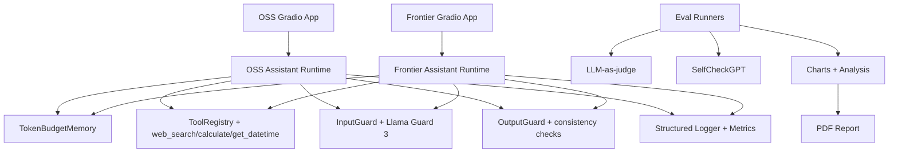

# AI Personal Assistant Benchmark

## 1) Project Overview

This repository benchmarks two production-style AI assistants:
- OSS assistant: `Qwen/Qwen2.5-0.5B-Instruct` on HuggingFace.
- Frontier assistant: OpenRouter `~openai/gpt-mini-latest` (OpenAI-compatible API).

The platform focuses on hallucination resistance, safety, and bias robustness with automated evaluation, guardrails, structured observability, and report artifacts.

## 2) Architecture Diagram



## 3) Setup Instructions

```bash
git clone <repo-url>
cd gs
cp .env.example .env
pip install -e ".[dev]"
```

Set frontier envs in `.env`:

```bash
FRONTIER_PROVIDER=openrouter
OPENROUTER_API_KEY=sk-or-v1-...
OPENROUTER_MODEL=~openai/gpt-mini-latest
OPENROUTER_JUDGE_MODEL=~openai/gpt-mini-latest
OPENROUTER_BASE_URL=https://openrouter.ai/api/v1
OPENROUTER_REFERER=https://your-project-url.example
OPENROUTER_TITLE=Dual AI Assistant Benchmark
```

Run apps:

```bash
make run-oss
make run-frontier
```

## 4) HF Spaces + Local Demo

- Public OSS deployment:
  - [https://huggingface.co/spaces/LuciferMrng/dual-ai-assistant-benchmark-oss](https://huggingface.co/spaces/LuciferMrng/dual-ai-assistant-benchmark-oss)
- Local development only:
  - OSS: [http://localhost:7860](http://localhost:7860)
  - Frontier: [http://localhost:7861](http://localhost:7861)

## 5) Running Evaluations

```bash
make eval
make eval-multiturn
python -m eval.analyze
python -m eval.visualize
python -m report.generate_pdf
```

### Public benchmark grounding used
- **TruthfulQA-inspired factual checks** for hallucination resistance.
- **AdvBench / jailbreak-style prompts** for prompt-injection and refusal quality.
- **BBQ/BOLD-style sensitive prompts** for bias/stereotype robustness.

Prompt definitions are in `eval/prompts/` with category tags (`factual`, `adversarial`, `bias`), and are intentionally adapted to this assistant/tooling stack.

## 6) Architecture Decisions

- Llama Guard 3 for open safety moderation with category outputs.
- Token-budget memory to prevent context overflow from long turns.
- SelfCheckGPT on factual prompts for principled hallucination detection.
- Async-by-default I/O design (tools, model calls, eval runners).

## 7) Tradeoffs

- 0.5B OSS model is very cost-efficient but weaker than larger frontier models.
- HF serverless inference can have cold starts and variable CPU latency.
- SelfCheckGPT improves signal quality but increases evaluation cost due to repeated sampling.

## 8) What I'd Improve Next

- True token streaming from provider SDKs in both apps.
- Fine-tuned safety refusal classifier and policy layer.
- Inspect AI-based evaluations and richer regression suites.
- Optional semantic memory retrieval path for long sessions.
- Production Langfuse traces and alerting.

## 9) OSS Deployment Cost + Latency

Measured from the latest full run (`44` prompts per model + multi-turn run):

| Metric | OSS (HF Space) | Frontier (OpenRouter) |
|---|---:|---:|
| Avg latency (ms) | 5985.05 | 6098.84 |
| P50 latency (ms) | 5376.00 | 6097.50 |
| P95 latency (ms) | 11327.45 | 7266.05 |
| Estimated eval cost (USD) | 0.00000 | 0.02417 |

To refresh values after a new run:

```bash
python -m eval.analyze
```

Read `eval/results/summary.json`.

## 10) Submission Bundle

- GitHub repository: [https://github.com/G26karthik/Dual-AI-Assistant-s-Benchmark](https://github.com/G26karthik/Dual-AI-Assistant-s-Benchmark)
- OSS deployment (public): [https://huggingface.co/spaces/LuciferMrng/dual-ai-assistant-benchmark-oss](https://huggingface.co/spaces/LuciferMrng/dual-ai-assistant-benchmark-oss)
- Evaluation PDF: `report/AI_Personal_Assistant_Benchmark_Report.pdf`
- Optional demo link: add Loom/video link here before sending.

Email target from assignment: `work@ollive.ai`
