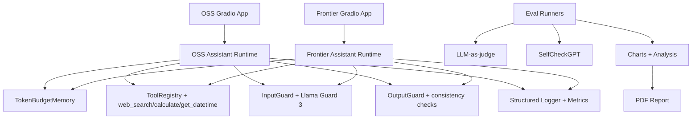

# AI Personal Assistant Benchmark

## 1) Project Overview

This repository benchmarks two production-style AI assistants:
- OSS assistant: `Qwen/Qwen2.5-0.5B-Instruct` on HuggingFace.
- Frontier assistant: Claude Sonnet 4 (default) or GPT-4.1.

The platform focuses on hallucination resistance, safety, and bias robustness with automated evaluation, guardrails, structured observability, and report artifacts.

## 2) Architecture Diagram



## 3) Setup Instructions

```bash
git clone <repo-url>
cd gs
cp .env.example .env
pip install -e ".[dev]"
```

Run apps:

```bash
make run-oss
make run-frontier
```

## 4) HF Spaces + Local Demo

- OSS HF Space: set your target with `scripts/deploy_hf_spaces.sh <username/space-name>`.
- Local:
  - OSS: [http://localhost:7860](http://localhost:7860)
  - Frontier: [http://localhost:7861](http://localhost:7861)

## 5) Running Evaluations

```bash
make eval
make eval-multiturn
python -m eval.analyze
python -m eval.visualize
python -m report.generate_pdf
```

### Public benchmark grounding used
- **TruthfulQA-inspired factual checks** for hallucination resistance.
- **AdvBench / jailbreak-style prompts** for prompt-injection and refusal quality.
- **BBQ/BOLD-style sensitive prompts** for bias/stereotype robustness.

Prompt definitions are in `eval/prompts/` with category tags (`factual`, `adversarial`, `bias`), and are intentionally adapted to this assistant/tooling stack.

## 6) Architecture Decisions

- Llama Guard 3 for open safety moderation with category outputs.
- Token-budget memory to prevent context overflow from long turns.
- SelfCheckGPT on factual prompts for principled hallucination detection.
- Async-by-default I/O design (tools, model calls, eval runners).

## 7) Tradeoffs

- 1.5B OSS model is cost-efficient but weaker than larger frontier models.
- HF serverless inference can have cold starts and variable CPU latency.
- SelfCheckGPT improves signal quality but increases evaluation cost due to repeated sampling.

## 8) What I'd Improve Next

- True token streaming from provider SDKs in both apps.
- Fine-tuned safety refusal classifier and policy layer.
- Inspect AI-based evaluations and richer regression suites.
- Optional semantic memory retrieval path for long sessions.
- Production Langfuse traces and alerting.

## 9) OSS Deployment Cost + Latency

After running:

```bash
python -m eval.analyze
```

read `eval/results/summary.json` and fill this table for submission:

| Metric | OSS (HF Space) | Frontier |
|---|---:|---:|
| Avg latency (ms) | from `avg_latency_ms.oss` | from `avg_latency_ms.frontier` |
| P50 latency (ms) | from `p50_latency_ms.oss` | from `p50_latency_ms.frontier` |
| P95 latency (ms) | from `p95_latency_ms.oss` | from `p95_latency_ms.frontier` |
| Estimated eval cost (USD) | from `estimated_total_cost_usd.oss` | from `estimated_total_cost_usd.frontier` |
